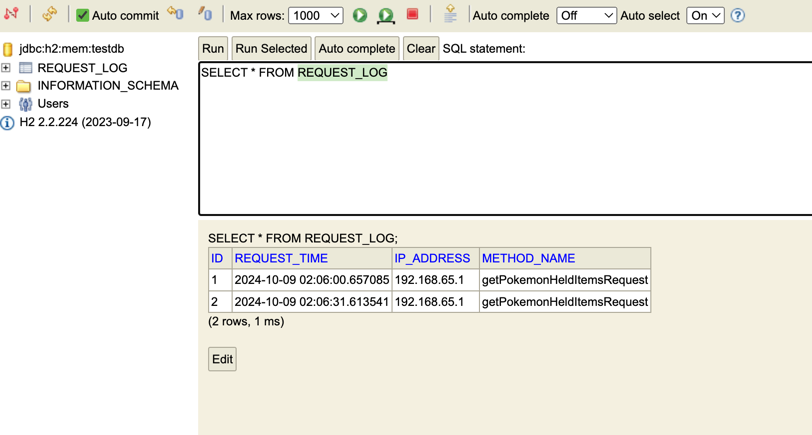

# PokemonService
[](https://reports.cucumber.io/report-collections/89dd6010-534c-45b1-b59e-9fbb638fd687)
[](https://sonarcloud.io/summary/overall?id=agustincperalta_PokemonService)

=======================


## Descripción

 Servicio SOAP en Java utilizando Spring Boot para consumir la API REST de [PokeAPI](https://pokeapi.co/api/v2/pokemon/). Obtiene información sobre un Pokémon en tiempo real: **habilidades, experiencia base, objetos retenidos, ID, nombre y áreas de encuentro**.

El servicio guarda los detalles de cada solicitud en una base de datos e incluye análisis de calidad de código con **SonarQube**, **pruebas unitarias**, y **pruebas con Cucumber.**


## Stack

 Java 17      | Spring Boot   |
 SOAP         | REST (WebClient)   |
 H2     | Docker   |
 SonarQube    | Github Actions   |
 Cucumber     | JUnit 5   |
 Mockito      |             

## Requisitos previos

- JDK 17 o superior
- Maven
- Docker (opcional si deseas dockerizar el proyecto)

## Instalación

 Clona el repositorio:

   ```bash
   git clone https://github.com/agustincperalta/PokemonService
   cd PokemonService
   ```
## Construye el proyecto

```bash
mvn clean install
```

## Ejecuta el servicio

```bash
mvn spring-boot:run
```

O si prefieres usar Docker:
Crea una imagen de PokemonService:
```
mvn clean install -Dimage
```
Y ejecuta la aplicacion
```bash
docker run -d -p 8080:8080 pokemon-service
```
## Operaciones SOAP Disponibles

El servicio ofrece los siguientes métodos SOAP para interactuar con la información de los Pokémon. Para obtener más detalles sobre cada operación y su ejecución, consulta la documentación en la wiki.

[Operaciones SOAP](https://github.com/agustincperalta/PokemonService/wiki/Operaciones-SOAP-Disponibles).

## Base de datos

El servicio guarda las siguientes variables en la base de datos cada vez que se realiza una solicitud:

- IP de origen
- Fecha de la solicitud
- Método ejecutado

### Acceso a la consola de H2

La consola de H2 está expuesta para que se puedan verificar los datos almacenados en la base de datos. Para acceder a la consola y ejecutar consultas, usa la siguiente URL y credenciales:

- **URL de la consola**: [http://localhost:8080/h2-console](http://localhost:8080/h2-console)
- **JDBC URL**: `jdbc:h2:mem:testdb`
- **Usuario**: `sa`
- **Contraseña**: `password`

### Consulta de los datos

La información se almacena en la tabla `REQUEST_LOG`. Se puede ejecutar la siguiente consulta SQL para ver los registros:

```sql
SELECT * FROM REQUEST_LOG;
```

## Análisis con SonarQube

El análisis de calidad de código está integrado mediante **SonarQube** utilizando **SonarCloud**, ejecutado automáticamente a través de **GitHub Actions**.

Puedes consultar los resultados del **análisis** y el **coverage** tanto en GitHub como directamente en SonarCloud haciendo clic en el siguiente badge:


[](https://sonarcloud.io/summary/overall?id=agustincperalta_PokemonService)

## Pruebas

### Unitarias (JUnit)

Ejecuta las pruebas unitarias usando el siguiente comando:

```bash
mvn test
```

### Cucumber

El proyecto incluye pruebas de integración con Cucumber. Para ejecutarlas:

```bash
mvn verify
```
Consulta los informes de Cucumber en [este enlace](https://reports.cucumber.io/report-collections/89dd6010-534c-45b1-b59e-9fbb638fd687).

## Estrategia de branching

- `main`: Contiene el código listo para producción.
- `develop`: Rama donde se realiza la integración de las nuevas características.
- `feature/<nombre-feature>`: Se utiliza para el desarrollo de nuevas características.
- `bugfix/<nombre-bugfix>`: Se utiliza para la corrección de errores.
